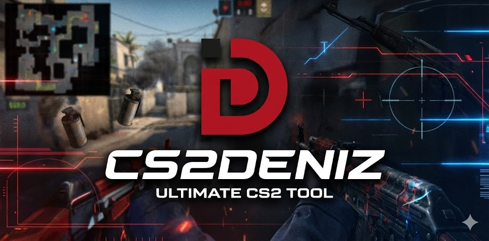

# Fully External CS2 Tool CS2Deniz

<div align="center">
  <!-- LOGO -->
  <!-- -->

  <br>
  <br>

  <!-- TAGS / BADGES -->
  
  
  
  
  
  <a href="https://www.virustotal.com/gui/file/7d4961933831dd05710ebc9e1934a41c20604e9707c9582feb89142edad7382f?nocache=1">
  
</a>
</div>

<!-- LINE SEPARATOR -->
<hr>

**CS2Deniz** is a lightweight, external cheat and overlay for **Counter-Strike 2**. It provides visual assistance and automation features while running entirely external to the game process.

> **⚠️ DISCLAIMER:** This software is for **educational purposes only**. Using cheats in online games violates Terms of Service and can lead to account bans. The author assumes no responsibility for how this software is used or any consequences resulting from its use.

**Regarding Bans:**
1.  **VAC Safety:** This software is designed to be **VAC Undetected** by operating entirely externally without memory injection.
2.  **User Responsibility:** The author is not responsible for bans resulting from **obvious/blatant usage**. If you use aimbot with high FOV or wallhack openly, you risk a behavioral ban (Game Ban) regardless of the software's stealth capabilities.

**Use at your own risk.**

---

## ⌨️ Features

### 🧠 **Intelligent Aimbot**
*   **Humanized Movement:** Uses "WindMouse" algorithm to mimic human cursor movement, reducing detection risk.
*   **Dynamic Smoothing:** Automatically adjusts smoothing and FOV based on your hit success rate.
*   **Bone Selection:** Prioritizes Head > Neck > Chest > Pelvis.
*   **Recoil Control System (RCS):** Compensates for weapon recoil (Aim Punch).
*   **Prediction:** Accounts for target velocity to hit moving enemies.

### 👁️ **Visuals (ESP)**
*   **Box ESP:** Draws 2D bounding boxes around enemies.
*   **Skeleton ESP:** Visualizes enemy bone structure for clear movement reading.
*   **Info Overlays:** Displays Name, Health (Bar + Text), and Current Weapon (Icon).
*   **Status Indicators:** Shows if an enemy is **Flashed**, **Scoped**, or **Shifting**.
*   **Recoil Crosshair:** Shows exactly where bullets will land.

### 🔫 **Triggerbot**
*   **Auto-Fire:** Automatically shoots when an enemy crosses your crosshair (Default: **Left Alt**).
*   **Jump Check:** Prevents firing while mid-air (velocity check) to ensure accuracy.
*   **Reaction Delay:** Human-like delay before firing.

### ⚙️ **Miscellaneous**
*   **Automatic Offsets:** Fetches the latest game offsets from GitHub on every launch. No manual updating required!
*   **Bomb Status:** Displays the C4 plant site (A or B).
*   **Stream Proof:** Uses `SetWindowDisplayAffinity` to hide visuals from capture software (OBS/Discord).
*   **Team Check:** Ignores teammates for both ESP and Aimbot.

---

## 📥 Download

If you just want to use the tool without building it yourself, download the latest pre-compiled version here:

[**Download CS2Deniz.zip (Latest Release)**](https://github.com/anas1412/CS2Deniz/releases/latest/download/CS2Deniz.zip)

*(Unzip the file to a folder of your choice before running).*

> [!NOTE]
> **🛡️ VirusTotal Scan: [3/72 (Click to View)](https://www.virustotal.com/gui/file/7d4961933831dd05710ebc9e1934a41c20604e9707c9582feb89142edad7382f?nocache=1)**
>
> **Regarding False Positives:** The detections shown are **false positives**. Because this software interacts with game memory (reading external process memory) and uses overlay hooks, generic antivirus heuristics may flag it as suspicious. This is standard behavior for game cheats and trainers.

---

## 🛠️ Prerequisites

The application is designed to **automatically install** necessary components (Runtime & Font) upon the first launch.

However, if the automatic setup fails or the application does not start, you may need to install them manually:

1.  **Administrative Privileges (REQUIRED)**  
    The application **must** be run as **Administrator** to perform the automatic setup, read game memory, and draw the overlay.

2.  **.NET Desktop Runtime 8.0.22 (x64)**  
    *   **Auto-Install:** The app attempts to download and install this if missing.
    *   **Manual:** [Download Runtime Installer](https://builds.dotnet.microsoft.com/dotnet/WindowsDesktop/8.0.22/windowsdesktop-runtime-8.0.22-win-x64.exe)

3.  **Undefeated Font**  
    *   **Auto-Install:** The app extracts and registers the font automatically.
    *   **Manual:**
        *   Locate `undefeated.ttf` in the `assets/` folder.
        *   Right-click the file and select **Install**.

---

## 🚀 How to Run

To ensure the overlay renders correctly and interacts with the game, follow these steps strictly:

### 1. Configure Game Video Settings
External overlays cannot draw over "Exclusive Fullscreen" mode.
1.  Open **Counter-Strike 2**.
2.  Go to **Settings** -> **Video** -> **Video**.
3.  Set **Display Mode** to **Fullscreen Windowed** (Borderless) or **Windowed**.
4.  Apply changes.

### 2. Launch the Cheat
1.  Navigate to the folder where you extracted or built the tool.
2.  Locate **`CS2Deniz.exe`**.
3.  **Right-click** the file and select **Run as Administrator**.
4.  The console will display: `Waiting for CS2 to start...` (if the game is not open) or `Cheat Activated!`.

---

## 🔧 Configuration

The application generates a `config.json` file after the first run. You can modify settings in two ways:

### Method A: Interactive Menu
1.  Run **`Configuration.exe`** (located in the same folder).
2.  Use the console menu to toggle features (Aimbot, ESP, Triggerbot, etc.) and change keybinds.
3.  Select "Save & Exit" to apply changes.

### Method B: Manual Editing
1.  Open `config.json` with any text editor (Notepad, VS Code).
2.  Change values (e.g., set `"AimBot": true` or change key codes).
3.  Save the file and restart the cheat.

---

## 👨‍💻 For Developers: Building from Source

If you want to modify the code or build the project yourself, follow these instructions to create a clean, single-file executable.

### Build Prerequisites
*   **.NET 8.0 SDK (v8.0.416)**  
    Required to compile the code.  
    [Download .NET 8.0 SDK (x64)](https://builds.dotnet.microsoft.com/dotnet/Sdk/8.0.416/dotnet-sdk-8.0.416-win-x64.exe)

### Build Instructions
1.  Clone the repository and open your terminal in the project root.
2.  Clean previous build artifacts:
    ```powershell
    dotnet clean
    ```
3.  Publish the project as a single file (Release mode):
    ```powershell
    dotnet publish -c Release -r win-x64 -p:PublishSingleFile=true --self-contained false
    ```
4.  **Locate the Output:**
    The executable will be located in:
    `.\bin\Release\net8.0-windows\win-x64\publish\`

5.  **Create the Config Tool:**
    *   Go to the publish folder above.
    *   Copy `CS2Deniz.exe`.
    *   Paste it in the same folder and rename it to **`Configuration.exe`**.
    *   *Note: Both files are required if you want to use the menu, but they share the same internal code.*

---

## 🛑 Troubleshooting

*   **Overlay not showing?**
    Ensure CS2 is in **Fullscreen Windowed** mode and you ran the `.exe` as **Administrator**.
*   **App fails to start or shows a .NET error?**
    If the automatic setup fails to launch, manually install the .NET Desktop Runtime linked in the Prerequisites section.
*   **ESP incorrect?**
    The cheat relies on memory offsets. If CS2 updates, the offsets must be updated. The application attempts to fetch the latest offsets automatically on startup.